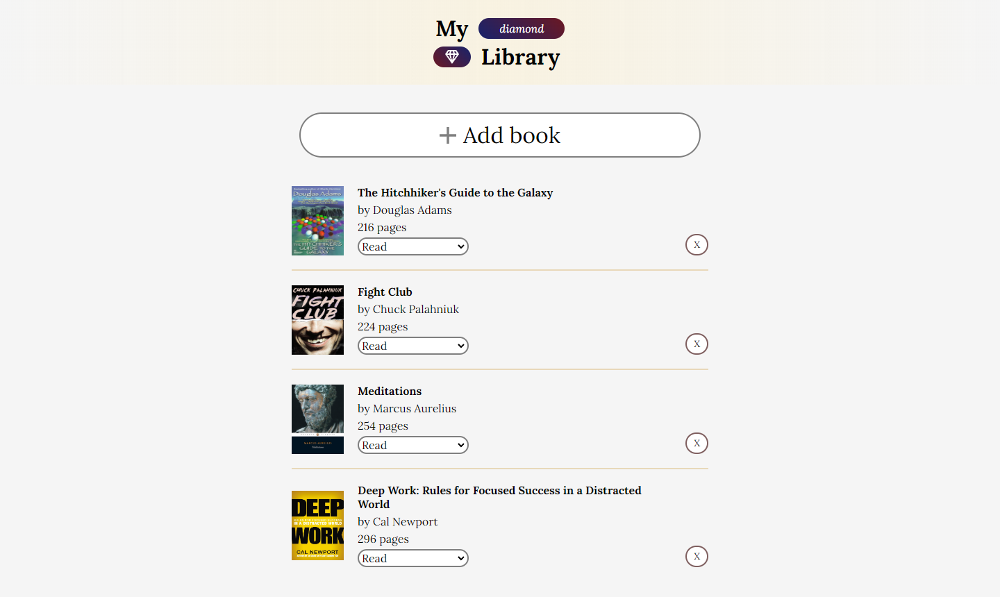

# Odin-Library

[Live link is here.](https://x6nenko.github.io/Odin-Library/)

## Project tasks.
- [x] Store all the books in the array of objects.
- [x] Loop through the array and display each book on the page.
- [x] Add a “NEW BOOK” button that brings up a form allowing users to input the details for the new book: author, title, number of pages, whether it’s been read and anything else you might want.
- [x] Add a button on each book’s display to remove the book from the library.
- [x] Add a button on each book’s display to change its read status

## Extra features. They are not required by a project. That's my list of optional ideas and tasks to make it better.

### Extra features that were implemented:
- [x] Make it responsive for mobile screens.

### Extra features and tasks to implement:
- [ ] Refactor the code. Make it more clean. DRY.